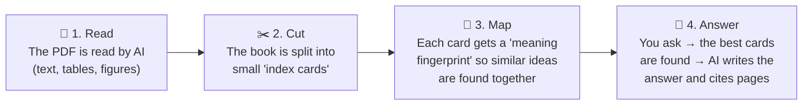

# 📘 DAMA-DMBOK Assistant

**Ask the Data Management Body of Knowledge a question in plain language — and get a clear answer with the exact page it comes from.**

---

## In one sentence

We turned the *DAMA-DMBOK* — the 600-page reference guide for data management — into a **smart assistant** that anyone can question like a colleague, built entirely on **Databricks**.

## Why this matters

| Today | With the assistant |
|---|---|
| Searching a 600-page PDF with `Ctrl+F` | Ask a question in everyday words |
| You need to know the exact term to find it | It understands the *meaning* of your question |
| Answers depend on who you ask | One shared, trusted reference for everyone |
| Hard to prove where a statement comes from | Every answer cites its **page numbers** |

**Typical questions it can answer:**

- *"What is the difference between data governance and data management?"*
- *"What are the dimensions of data quality?"*
- *"Who should own master data?"*
- *"Quels sont les rôles d'un Data Steward ?"* (it answers in the language of the question)

---

## How it works — the simple version

Think of it as hiring a very fast librarian who has read the whole book.



1. **Read** – Databricks AI reads the PDF, including tables and diagrams, not just plain text.
2. **Cut** – The book is split into short, self-contained passages ("index cards"), each tagged with its page numbers.
3. **Map** – Each passage is converted into a *meaning fingerprint* (a vector). This lets the system find passages that talk about the same idea, even if they use different words.
4. **Answer** – When you ask a question, the assistant picks the most relevant passages and an AI model writes a short answer **based only on those passages**, with page references.

> 💡 **Key point for managers:** the AI does not "make up" knowledge. It is instructed to answer *only* from the DMBOK passages it retrieved, and to say so when the book does not cover the topic.

---

## What you get

- 🖥️ **A web page** (Databricks App) with a chat interface — no installation for end users.
- 🔎 **Sources shown for every answer** — click to see the original passages and pages.
- 🔄 **Automatic updates** — drop a new PDF version into the folder, re-run the pipeline, and the assistant is up to date.
- 🔐 **Governed by Unity Catalog** — access to the documents and the assistant follows the company's existing Databricks permissions.

---

## What's under the hood (for the curious)

| Step | Databricks feature | What it does |
|---|---|---|
| Store the PDF | **Unity Catalog Volume** | Secure file storage |
| Read | `ai_parse_document` | AI extraction of text, tables and figures |
| Cut | `ai_prep_search` *(Beta)* | Automatic, context-aware splitting into passages |
| Map | **Mosaic AI Vector Search** | Meaning-based search index, kept in sync automatically |
| Answer | **Foundation Model APIs** | Large language model that writes the answer |
| Interface | **Databricks Apps** (Streamlit) | The chat web page |

Everything runs through the Databricks platform and its governed model endpoints — no separate external tool or API key is needed.

---

## Repository structure

```
dama_rag/
├── 01_parse_documents.py              # Step 1 – read the PDF with AI
├── 02_prep_search_and_vectorize.py    # Steps 2–3 – automatic cutting + search index (recommended)
├── 02_chunk_and_vectorize.py          # Steps 2–3 – alternative with custom cutting rules
└── app/
    ├── app.py                         # Step 4 – the chat web page
    ├── app.yaml                       # App settings (which index, which AI model)
    └── requirements.txt               # Python libraries for the app
```

---

## Getting started (technical team)

1. Upload the DMBOK PDF to the volume `/Volumes/dama/documents/incoming/`.
2. Run `01_parse_documents.py` → creates the table `dama.documents.dmbok`.
3. Run `02_prep_search_and_vectorize.py` → creates the chunks table and the Vector Search index.
4. Deploy the `app/` folder as a **Databricks App** and grant its service principal:
   - `USE CATALOG` / `USE SCHEMA` on `dama.documents`
   - `SELECT` on the Vector Search index
   - `CAN QUERY` on the model serving endpoint
5. Share the App URL with users.

**Prerequisites:** Databricks workspace with Unity Catalog, serverless compute (environment v3+ or DBR 18.2+), Vector Search, and the `ai_prep_search` preview enabled.

---

## Good to know

- **Copyright:** the DAMA-DMBOK is a copyrighted publication. The PDF is **not** stored in this repository and must be obtained under a valid licence.
- **Cost:** mainly driven by the one-off document processing, the Vector Search endpoint (always on), and the number of questions asked.
- **Quality:** answers are only as good as the retrieved passages — always check the cited pages for important decisions.
- **Scope:** today one reference book; the same pipeline can ingest internal policies, standards or glossaries.

---

## Next steps

- [ ] Add internal data governance policies alongside the DMBOK
- [ ] Measure answer quality with a set of reference questions
- [ ] Collect user feedback (👍 / 👎) directly in the app

---

*Built as part of a Databricks certification learning project.*
